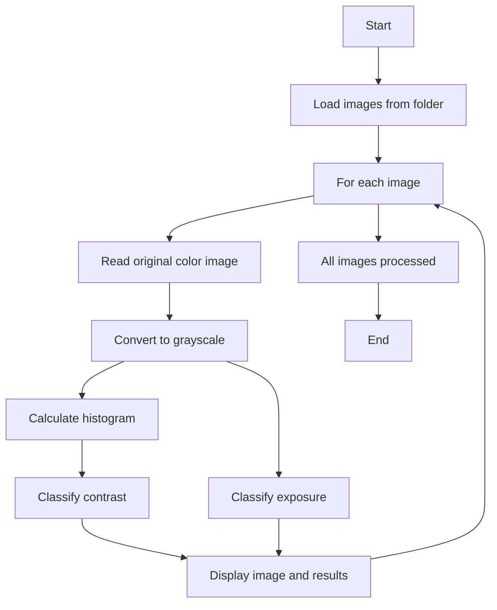

# Image-Exposure-and-Contrast-Analyzer
This Python project analyzes a folder of images to classify their contrast quality and exposure status. For each image, it displays:

- The original color image

- The grayscale image with exposure classification

-The histogram of pixel intensities with contrast classification

This helps quickly assess the visual quality of images in terms of exposure and contrast.


## Features

- Supports common image formats: JPG, PNG, BMP, TIFF

- Automatically processes all images in a specified folder

- Classifies images as Underexposed, Overexposed, or Normal Exposure

- Classifies contrast as Poor, Moderate, or Good based on histogram spread

- Visualizes results with plots for easy interpretation


## High End Architecture




  
## Project Flow

- Loads each image in color and grayscale

- Calculates the histogram and percentiles of grayscale intensities

- Uses thresholds to classify exposure based on ratio of dark and bright pixels

- Uses percentile ranges of pixel intensity distribution to classify contrast

- Displays the original image, grayscale image, and histogram with classification info

## Insatallation and Usage

1. Clone this repository:
   ```bash
   git clone https://github.com/dhanya807/Image-Exposure-and-Contrast-Analyzer.git
   cd Image-Exposure-and-Contrast-Analyzer

---
2. Install dependencies (recommended in a virtual environment):
   pip install opencv-python numpy matplotlib
---
3. Prepare a folder with your images. Supported formats: .jpg, .jpeg, .png, .bmp, .tif, .tiff
---
4. Update the folder path in the script (folder_path variable) to your image folder location.
---
5. Run the script and View the output:
For each image, the script prints contrast and exposure classification in the terminal, and displays a plot showing:

  - Original color image

 - Grayscale image with exposure status

 - Histogram with contrast status


